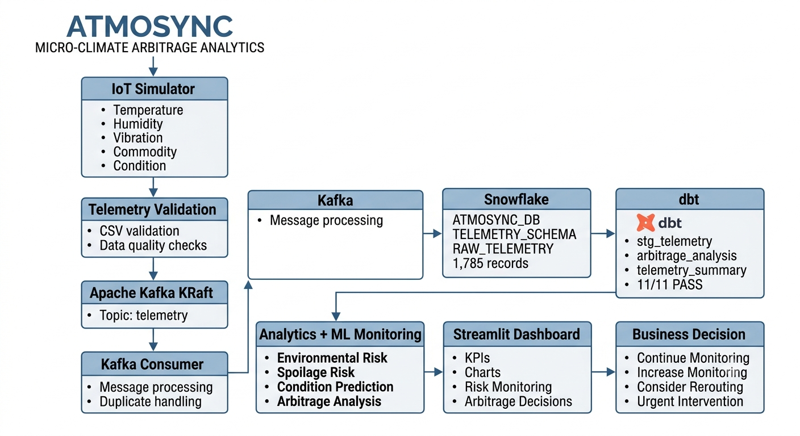
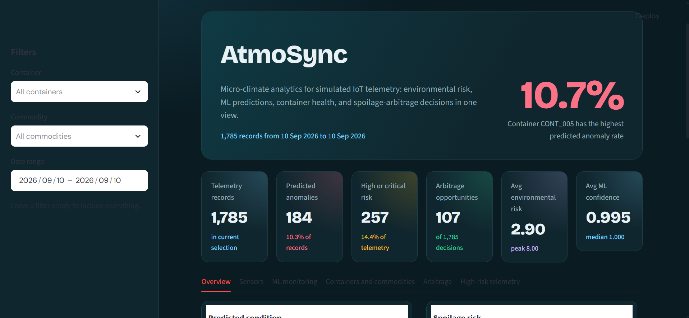
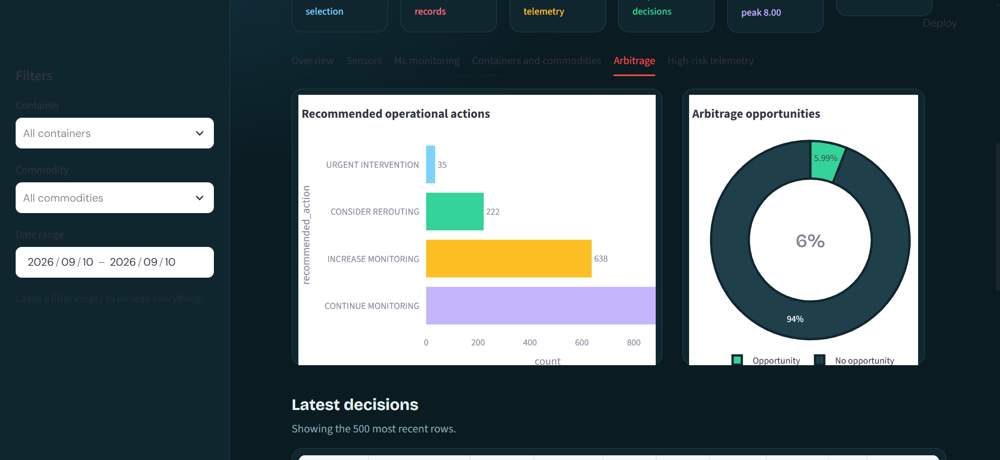
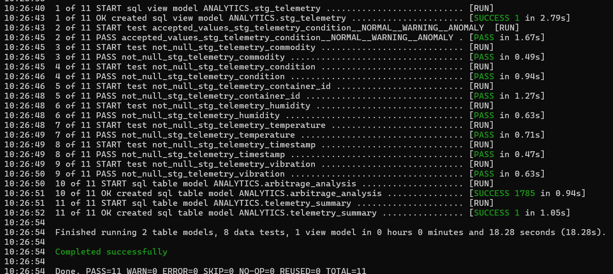
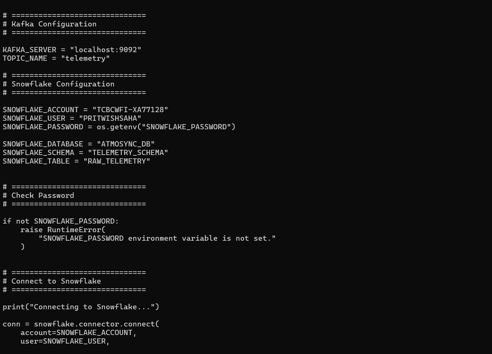
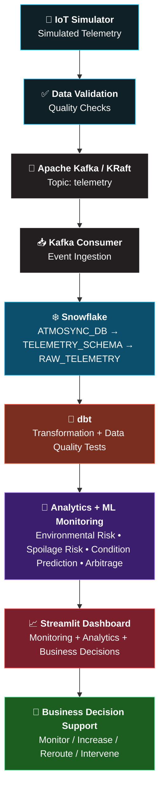
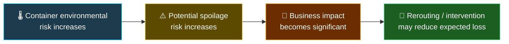
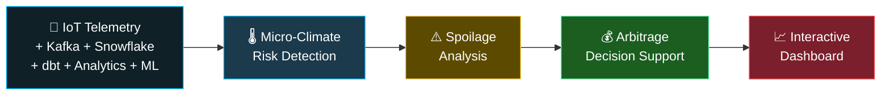

<div align="center">


### 🌍 Monitor &nbsp;•&nbsp; 🔮 Predict &nbsp;•&nbsp; 📊 Analyze &nbsp;•&nbsp; 🎯 Decide

<a href="https://git.io/typing-svg"></a>

<br/>


<br/>

[📌 Overview](#-project-overview)  | 
[🏗️ Architecture](#️-system-architecture)  | 
[📊 Dataset](#-dataset)  | 
[📈 Dashboard](#-dashboard)  | 
[▶️ Run It](#️-running-the-project)  | 
[🔬 Verification](#-verification-results)

---

## 📌 Project Overview

AtmoSync is a micro-climate analytics system for simulated IoT container telemetry. It combines environmental monitoring, ML predictions, spoilage-risk analysis, and spoilage-arbitrage decisions to support container-level business decisions.

---

## 🏗️ System Architecture



The verified pipeline follows:

**IoT Simulator → Validation → Kafka → Kafka Consumer → Snowflake → dbt → Analytics & ML Monitoring → Streamlit Dashboard → Business Decision**

---

## 📊 Dataset

The project uses simulated IoT telemetry containing:

| Metric            |                      Value |
| ----------------- | -------------------------: |
| Telemetry Records |                      1,785 |
| Containers        |                          5 |
| Commodities       |                          4 |
| Telemetry Fields  |                          7 |
| Conditions        | Normal / Warning / Anomaly |

The telemetry contains container ID, timestamp, commodity, temperature, humidity, vibration, and condition.

---

## 📈 Dashboard



The dashboard provides:

* Environmental risk monitoring
* Sensor analytics
* ML prediction monitoring
* Container-level analysis
* Commodity-level analysis
* Spoilage-risk analysis
* Spoilage-arbitrage decisions
* High-risk telemetry monitoring

### Spoilage Arbitrage Analysis



The system supports four business actions:

| Decision            | Records |
| ------------------- | ------: |
| CONTINUE MONITORING |     890 |
| INCREASE MONITORING |     638 |
| CONSIDER REROUTING  |     222 |
| URGENT INTERVENTION |      35 |

---

## ▶️ Running the Project

The dashboard can be run locally using Docker.

```bash
docker build -t atmosync-dashboard .
docker run --rm -p 8501:8501 atmosync-dashboard
```

Then open:

```text
http://localhost:8501
```

---

## 🔬 Verification Results

### dbt Verification



The dbt pipeline was successfully validated with:

```text
PASS=11
WARN=0
ERROR=0
SKIP=0
NO-OP=0
REUSED=0
TOTAL=11
```

### Kafka → Snowflake Verification



The Kafka consumer verification processed the complete telemetry dataset:

```text
Messages processed: 1785
Records inserted:   0
Records skipped:    1785
Records failed:     0
```

The records were skipped because they were already present in Snowflake, verifying the duplicate-handling logic.

</div>

---

## 📌 Project Overview

Traditional supply-chain analytics lean on standard transit times and macro-level weather data. But conditions **inside an individual shipping container** can differ dramatically from the outside world.

**AtmoSync focuses on that container-level micro-climate.**

It combines simulated IoT telemetry, Apache Kafka, Snowflake, dbt, machine-learning monitoring, and a Streamlit dashboard to turn raw container telemetry into **actionable business insights**: spotting spoilage risk, flagging anomalies, and recommending interventions.

### 👀 What the system monitors

| | Signal | | Signal |
|:-:|---|:-:|---|
| 🌡️ | **Temperature** | 🚢 | **Container** |
| 💧 | **Humidity** | ⚠️ | **Environmental condition** |
| 📳 | **Vibration** | 🤖 | **ML-predicted condition** |
| 📦 | **Commodity** | | |

### 🧭 Decisions it supports

| | Action | Meaning |
|:-:|---|---|
| 🟢 | **CONTINUE MONITORING** | Risk is manageable |
| 🟡 | **INCREASE MONITORING** | Risk requires closer observation |
| 🟠 | **CONSIDER REROUTING** | Risk may justify changing the route |
| 🔴 | **URGENT INTERVENTION** | Immediate action may be required |

---

## 🎯 Objectives

1. 📡 Simulate IoT-based container telemetry
2. ✅ Validate telemetry before analytical processing
3. 🚀 Ingest telemetry through Apache Kafka
4. ❄️ Store raw telemetry in Snowflake
5. 🔧 Transform and validate data using dbt
6. ⚠️ Analyze environmental and spoilage risk
7. 🤖 Monitor ML-based condition predictions
8. 💰 Identify spoilage-arbitrage opportunities
9. 📈 Present insights through an interactive dashboard
10. 🧭 Provide business-oriented decision support

---

## 🏗️ System Architecture



### 🔄 End-to-End Data Flow

```text
📡 Simulated IoT Telemetry
        ⬇
✅ Telemetry Validation
        ⬇
🚀 Kafka Producer  ➜  Topic: telemetry
        ⬇
📥 Kafka Consumer
        ⬇
❄️ Snowflake RAW_TELEMETRY
        ⬇
🔧 dbt Transformation
        ⬇
🧠 Analytics + ML Monitoring
        ⬇
📈 Streamlit Dashboard
        ⬇
💰 Spoilage-Arbitrage Decisions
```

---

## 📊 Dataset

### 🔢 At a glance

| 📄 Telemetry records | 🚢 Containers | 📦 Commodities | 🧪 Telemetry features |
|:-:|:-:|:-:|:-:|
| **1,785** | **5** | **4** | **7** |

### 🚦 Condition distribution

```text
🟢 Normal   1,249  ██████████████████████████████████░░░░░░░░░░░░░░░  70.0%
🟡 Warning    352  ██████████░░░░░░░░░░░░░░░░░░░░░░░░░░░░░░░░░░░░░░░  19.7%
🔴 Anomaly    184  █████░░░░░░░░░░░░░░░░░░░░░░░░░░░░░░░░░░░░░░░░░░░░  10.3%
```

<table>
<tr>
<td valign="top">

**🚢 Containers**
```text
CONT_001
CONT_002
CONT_003
CONT_004
CONT_005
```

</td>
<td valign="top">

**📦 Commodities**
```text
🥑 Avocado
🍌 Banana
🥭 Mango
🍅 Tomato
```

</td>
<td valign="top">

**🧾 Telemetry schema**
```text
container_id
timestamp
commodity
temperature
humidity
vibration
condition
```

</td>
</tr>
</table>

---

## ⚙️ Technology Stack

| Layer | Tools |
|---|---|
| 🛠️ **Data Engineering** | Python • Apache Kafka (KRaft) • Snowflake • SQL • dbt |
| 🧠 **Analytics & ML** | Pandas • NumPy • Scikit-learn • Environmental Risk Analysis • Spoilage Risk Analysis • Condition Prediction • Arbitrage Decision Engine |
| 🎨 **Visualization** | Streamlit • Matplotlib • Seaborn |
| 🚢 **Deployment & Dev** | Docker • Git • GitHub • PowerShell |

---

## 🚀 Key Components

### 1️⃣ 📡 IoT Telemetry Simulator

Generates synthetic container telemetry that represents environmental conditions during transportation.

```text
Container:    CONT_001
Commodity:    Mango
Temperature:  12.4°C
Humidity:     88%
Vibration:    0.21
Condition:    WARNING
```

> [!NOTE]
> The data is simulated for analytical and engineering purposes and does not represent real IoT hardware.

### 2️⃣ ✅ Data Validation

Before ingestion, telemetry is checked for:

- 🕳️ Missing values
- 👯 Duplicate records
- 🚫 Invalid sensor values
- 🔤 Incorrect data types
- 🏷️ Valid condition values
- 🔗 Data consistency

The validated dataset contains **1,785 records**.

### 3️⃣ 🚀 Apache Kafka

Kafka provides the event-based ingestion layer.

| Setting | Value |
|---|---|
| **Kafka mode** | KRaft |
| **Broker** | `localhost:9092` |
| **Topic** | `telemetry` |

The producer publishes validated telemetry to the `telemetry` topic. The consumer reads the messages and loads them into Snowflake.

**✅ Verified result**

```text
Messages processed: 1,785
Records inserted:   0
Records skipped:    1,785
Records failed:     0
```

> [!TIP]
> The records were skipped during final verification because the same telemetry was already present in Snowflake. This confirmed that the consumer's **duplicate-handling logic works correctly**.

### 4️⃣ ❄️ Snowflake Data Warehouse

| | |
|---|---|
| **Database** | `ATMOSYNC_DB` |
| **Schema** | `TELEMETRY_SCHEMA` |
| **Raw table** | `RAW_TELEMETRY` |
| **Verified records** | **1,785** |

### 5️⃣ 🔧 dbt Transformation

dbt handles SQL-based transformation, modeling, and data-quality testing.

**Verified models**

```text
ANALYTICS.stg_telemetry
ANALYTICS.arbitrage_analysis
ANALYTICS.telemetry_summary
```

| 🧱 Models | 🧪 Data tests | 📥 Sources |
|:-:|:-:|:-:|
| **3** | **8** | **1** |

**Final build result**

```text
PASS=11   WARN=0   ERROR=0   SKIP=0   NO-OP=0   REUSED=0   TOTAL=11
```

✅ The complete dbt build passed **all 11 configured nodes**.

### 6️⃣ 🤖 ML Prediction Monitoring

A condition-prediction workflow monitors the environmental condition of each telemetry record. The monitoring layer tracks:

- 🎯 Actual condition
- 🔮 Predicted condition
- 📶 Prediction confidence
- 🏷️ Confidence category
- ✔️ Prediction status
- 🔔 Monitoring level

These results feed directly into the overall risk and decision-support workflow.

### 7️⃣ ⚠️ Spoilage Risk Analysis

Environmental telemetry is used to calculate a project-specific **spoilage risk / spoilage score**, which represents the potential risk that current conditions could negatively affect the transported commodity.

The analysis considers:

| 🌡️ Temperature | 💧 Humidity | 📳 Vibration | 📦 Commodity-specific conditions | 🚨 Detected anomalies |
|:-:|:-:|:-:|:-:|:-:|

Higher environmental risk leads to stronger monitoring or intervention recommendations.

### 8️⃣ 💰 Spoilage Arbitrage

**Micro-climate arbitrage** means identifying a business opportunity created by a change in the environmental condition of an *individual* shipping container.



The system converts analytical risk into business-oriented actions (see [Decisions it supports](#-decisions-it-supports)).

---

## 📈 Dashboard

The Streamlit dashboard is the centralized monitoring and analytics interface.

<!--
📸 TIP: add a screenshot of your dashboard here for maximum impact:

-->

### 🏆 Main KPIs

| 📄 Telemetry Records | 🚨 Predicted Anomalies | 🔥 High/Critical Risk | 💰 Arbitrage Opportunities | 🌡️ Avg Environmental Risk | 🤖 Avg ML Confidence |
|:-:|:-:|:-:|:-:|:-:|:-:|
| **1,785** | **184** | **257** | **107** | **2.90** | **0.995** |

### 🧩 Dashboard sections

| | | |
|---|---|---|
| 🚦 Condition Monitoring | 📡 Sensor Analytics | ⚠️ Spoilage Risk Analytics |
| 🤖 ML Prediction Monitoring | 🚢 Container-Level Analysis | 📦 Commodity-Level Analysis |
| 💰 Spoilage Arbitrage Decisions | 🔥 High-Risk Telemetry | |

---

## 🐳 Docker Deployment

The Streamlit dashboard is containerized and has been **successfully tested locally**.

| | |
|---|---|
| **Image** | `atmosync-dashboard:latest` |
| **Container** | `atmosync-dashboard` |
| **Port** | `8501` |

```bash
docker run -p 8501:8501 atmosync-dashboard
```

Then open 👉 **http://localhost:8501**

---

## 📁 Project Structure

<details>
<summary><b>Click to expand 📂</b></summary>

```text
AtmoSync/
│
├── analytics/
│   ├── arbitrage_engine.py
│   ├── commodity_rules.py
│   └── spoilage_risk.py
│
├── architecture/
│   └── atmosync_pipeline_architecture.md
│
├── dashboard/
│   ├── app.py
│   ├── README.md
│   └── requirements.txt
│
├── data/
│   ├── raw/
│   ├── processed/
│   └── validated/
│
├── dbt/
│   └── atmosync_dbt/
│
├── kafka/
│   ├── producer.py
│   ├── consumer.py
│   └── ...
│
├── pipeline/
│   └── config/
│
├── scripts/
│   ├── validate_telemetry.py
│   ├── preprocess_telemetry.py
│   ├── analyze_microclimate.py
│   ├── advanced_analytics.py
│   ├── train_condition_model.py
│   └── create_prediction_monitoring.py
│
├── simulator/
│   └── iot_simulator.py
│
├── warehouse/
│   └── ...
│
├── Dockerfile
├── .dockerignore
└── README.md
```

</details>

---

## ▶️ Running the Project

### 🖥️ Option A: Run locally

**1. Clone the repository**

```bash
git clone https://github.com/PritwishSaha/AtmoSync.git
cd AtmoSync
```

**2. Create a Python virtual environment** (Windows PowerShell)

```powershell
python -m venv .venv
.\.venv\Scripts\Activate.ps1
```

**3. Install dashboard dependencies**

```powershell
pip install -r dashboard\requirements.txt
```

**4. Launch the Streamlit dashboard**

```powershell
streamlit run dashboard\app.py
```

Then open 👉 **http://localhost:8501**

### 🐳 Option B: Run with Docker

**Build the image**

```powershell
docker build -t atmosync-dashboard .
```

**Run the container**

```powershell
docker run --name atmosync-dashboard -p 8501:8501 atmosync-dashboard
```

Then open 👉 **http://localhost:8501**

---

## 🔬 Verification Results

Every major pipeline component was verified in the final implementation.

| Component | Check | Result |
|:-:|---|:-:|
| 🚀 **Kafka** | Topic `telemetry` • 1,785 messages processed • 0 failed | ✅ |
| ❄️ **Snowflake** | `ATMOSYNC_DB.TELEMETRY_SCHEMA.RAW_TELEMETRY` • 1,785 records | ✅ |
| 🔧 **dbt** | 3 models • 8 tests • 1 source • PASS 11 / WARN 0 / ERROR 0 | ✅ |
| 📈 **Streamlit** | Dashboard working | ✅ |
| 🐳 **Docker** | Container working on port 8501 | ✅ |
| 🌿 **Git** | Branch `main` • remote `origin/main` • working tree clean | ✅ |

---

## 📌 Current Project Status

<div align="center">

### ✅ Final Review Ready

</div>

The major components of AtmoSync have been developed, integrated, tested, documented, and pushed to GitHub.

> [!IMPORTANT]
> This is a **local, internship-scale analytical system** that uses **simulated IoT telemetry**. It should not be interpreted as a production deployment or as a system connected to physical IoT devices.

### ⚠️ Project Limitations

- 🧪 Telemetry data is simulated rather than collected from physical IoT devices.
- 🖥️ Kafka runs as a local single-node KRaft environment.
- 🎓 The system is intended for analytical and internship demonstration purposes, not production.
- 🐳 The dashboard is containerized locally with Docker.
- 🏭 Production-scale orchestration, monitoring, security, and high availability are outside the current scope.

---

## 🔮 Future Enhancements

| 📡 Data & Streaming | 🧠 Intelligence | 🏭 Production Readiness |
|---|---|---|
| Integration with real IoT sensors | Automated model retraining | Production-grade monitoring & observability |
| Multi-node Kafka deployment | Advanced time-series forecasting | Role-based dashboard access |
| Cloud-based streaming infrastructure | Route optimization | Real-time alert notifications |
| Real-time telemetry ingestion | Cost-aware dynamic rerouting | Cloud deployment & orchestration |

---

## 🎓 Internship Project

**Project:** AtmoSync: Micro-Climate Arbitrage Analytics

**Focus areas:**
`Data Engineering` &nbsp; `Data Analytics` &nbsp; `Machine Learning` &nbsp; `Streaming Data` &nbsp; `Cloud Data Warehousing` &nbsp; `Business Intelligence` &nbsp; `Decision Support`

---

## 👨‍💻 Author

<div align="center">

**Pritwish Saha**
B.Tech CSE (AI & ML) • Brainware University

[](https://github.com/PritwishSaha)

</div>

---

## ⭐ Project Summary



<div align="center">

**AtmoSync transforms container-level environmental telemetry into analytical insights and actionable supply-chain decisions.**

⭐ *If you find this project interesting, consider giving it a star!* ⭐


</div>
