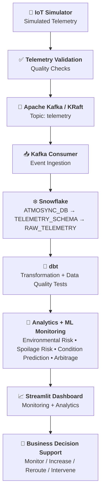
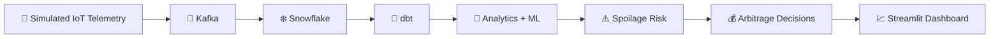

<div align="center">


### 🌍 Monitor  •  🔮 Predict  •  📊 Analyze  •  🎯 Decide

<a href="https://git.io/typing-svg"></a>

<br/>


<br/>

[📌 Overview](#-project-overview)  | 
[🏗️ Architecture](#️-system-architecture)  | 
[📊 Dataset](#-dataset)  | 
[📈 Dashboard](#-dashboard)  | 
[▶️ Run It](#️-running-the-project)  | 
[🔬 Verification](#-verification-results)

</div>

---

## 📌 Project Overview

**AtmoSync — Micro-Climate Arbitrage Analytics** is an analytical system designed to monitor **container-level environmental conditions** in simulated shipping telemetry.

Traditional supply-chain analytics often rely on standard transit times and macro-level weather information. However, the environmental conditions **inside an individual shipping container** can change independently and may create additional spoilage risk.

AtmoSync focuses on these micro-climate changes by combining:

* 📡 Simulated IoT container telemetry
* 🚀 Apache Kafka event-based ingestion
* ❄️ Snowflake data warehousing
* 🔧 dbt transformation and data-quality testing
* ⚠️ Environmental and spoilage-risk analysis
* 🤖 Machine-learning condition prediction monitoring
* 💰 Spoilage-arbitrage decision analysis
* 📈 Streamlit visualization and monitoring

The objective is to transform raw telemetry into **analytical insights and business-oriented decision support**.

> [!NOTE]
> AtmoSync uses **simulated IoT telemetry** for analytical and engineering purposes. It is not connected to physical IoT devices.

---

## 🎯 Objectives

1. 📡 Simulate IoT-based container telemetry
2. ✅ Validate telemetry before analytical processing
3. 🚀 Ingest validated telemetry through Apache Kafka
4. ❄️ Store raw telemetry in Snowflake
5. 🔧 Transform and test analytical data using dbt
6. ⚠️ Analyze environmental and spoilage risk
7. 🤖 Monitor ML-based condition predictions
8. 💰 Identify potential spoilage-arbitrage opportunities
9. 📈 Present analytical insights through an interactive dashboard
10. 🧭 Convert analytical risk into business-oriented actions

---

## 🏗️ System Architecture

The verified AtmoSync pipeline follows:

**IoT Simulator → Telemetry Validation → Apache Kafka → Kafka Consumer → Snowflake → dbt → Analytics & ML Monitoring → Streamlit Dashboard → Business Decision Support**


### 🔄 Architecture Flow



### 🔄 End-to-End Data Flow

```text
📡 Simulated IoT Telemetry
        ⬇
✅ Telemetry Validation
        ⬇
🚀 Kafka Producer
        ⬇
📨 Kafka Topic: telemetry
        ⬇
📥 Kafka Consumer
        ⬇
❄️ Snowflake RAW_TELEMETRY
        ⬇
🔧 dbt Transformation
        ⬇
🧠 Analytics + ML Monitoring
        ⬇
📈 Streamlit Dashboard
        ⬇
💰 Spoilage-Arbitrage Decisions
```

> [!IMPORTANT]
> Kafka is implemented and verified in a **local single-node KRaft environment**. The telemetry source is simulated rather than physical IoT hardware.

---

## 📊 Dataset

AtmoSync uses a validated simulated IoT telemetry dataset.

### 🔢 Dataset at a glance

| Metric                   |     Value |
| ------------------------ | --------: |
| 📄 Telemetry Records     | **1,785** |
| 🚢 Containers            |     **5** |
| 📦 Commodities           |     **4** |
| 🧪 Telemetry Fields      |     **7** |
| ❌ Missing Values         |     **0** |
| ❌ Duplicate Records      |     **0** |
| ❌ Invalid Sensor Records |     **0** |

### 🚢 Containers

```text
CONT_001
CONT_002
CONT_003
CONT_004
CONT_005
```

### 📦 Commodities

```text
🥑 Avocado
🍌 Banana
🥭 Mango
🍅 Tomato
```

### 🧾 Telemetry Schema

| Column         | Description                          |
| -------------- | ------------------------------------ |
| `container_id` | Unique shipping container identifier |
| `timestamp`    | Time at which telemetry was recorded |
| `commodity`    | Commodity being transported          |
| `temperature`  | Container temperature                |
| `humidity`     | Container humidity                   |
| `vibration`    | Measured vibration level             |
| `condition`    | Operational condition classification |

### 🚦 Condition Distribution

| Condition  |   Records | Percentage |
| ---------- | --------: | ---------: |
| 🟢 NORMAL  |     1,249 |      70.0% |
| 🟡 WARNING |       352 |      19.7% |
| 🔴 ANOMALY |       184 |      10.3% |
| **Total**  | **1,785** |   **100%** |

---

## ⚙️ Technology Stack

| Layer                 | Technologies                                                           |
| --------------------- | ---------------------------------------------------------------------- |
| 🛠️ Data Engineering  | Python • Apache Kafka • KRaft • Snowflake • SQL • dbt                  |
| 🧠 Analytics & ML     | Pandas • NumPy • Scikit-learn • Risk Analysis • Condition Prediction   |
| ⚠️ Decision Analytics | Spoilage Risk • Spoilage Arbitrage • Commodity Rules • Decision Engine |
| 🎨 Visualization      | Streamlit • Matplotlib • Seaborn                                       |
| 🐳 Deployment         | Docker                                                                 |
| 🌿 Development        | Git • GitHub • PowerShell                                              |

---

## 🚀 Key Components

### 1️⃣ 📡 IoT Telemetry Simulator

The project uses a Python-based simulator to generate synthetic container telemetry representing environmental conditions during transportation.

Example:

```text
Container:    CONT_001
Commodity:    Mango
Temperature:  12.4°C
Humidity:     88%
Vibration:    0.21
Condition:    WARNING
```

The simulator produces telemetry containing:

* Container ID
* Timestamp
* Commodity
* Temperature
* Humidity
* Vibration
* Condition

> [!NOTE]
> The telemetry is simulated and does not represent readings from physical IoT sensors.

---

### 2️⃣ ✅ Telemetry Validation

Before analytical processing, telemetry is validated for:

* 🕳️ Missing values
* 👯 Duplicate records
* 🚫 Invalid sensor values
* 🔤 Data types
* 🏷️ Valid condition values
* 🌡️ Temperature ranges
* 💧 Humidity values
* 📳 Vibration measurements

### Validation Result

```text
Total records:          1,785
Missing values:         0
Duplicate records:      0
Invalid sensor records: 0
```

The validated dataset contains **1,785 records**.

---

### 3️⃣ 🚀 Apache Kafka

Apache Kafka provides the event-based ingestion layer.

| Setting    | Verified Value                 |
| ---------- | ------------------------------ |
| Kafka Mode | **KRaft**                      |
| Broker     | `localhost:9092`               |
| Topic      | `telemetry`                    |
| Node       | Single local broker/controller |

The producer publishes validated telemetry to the `telemetry` topic.

The consumer reads the messages and performs duplicate checking before loading records into Snowflake.

#### Kafka Verification

```text
Messages processed: 1,785
Records inserted:   0
Records skipped:    1,785
Records failed:     0
```

The final verification skipped the records because the same telemetry was already present in Snowflake.

This verifies that the consumer's **duplicate-handling logic works correctly** and that no duplicate records were inserted.

---

### 4️⃣ ❄️ Snowflake Data Warehouse

Snowflake is the analytical warehouse layer used by AtmoSync.

| Configuration    | Value              |
| ---------------- | ------------------ |
| Database         | `ATMOSYNC_DB`      |
| Schema           | `TELEMETRY_SCHEMA` |
| Raw Table        | `RAW_TELEMETRY`    |
| Verified Records | **1,785**          |

The verified raw telemetry table is:

```text
ATMOSYNC_DB.TELEMETRY_SCHEMA.RAW_TELEMETRY
```

---

### 5️⃣ 🔧 dbt Transformation & Data Quality

dbt is used for SQL-based transformation, analytical modeling, and data-quality testing.

### Verified Models

```text
ANALYTICS.stg_telemetry
ANALYTICS.arbitrage_analysis
ANALYTICS.telemetry_summary
```

| Component     |   Count |
| ------------- | ------: |
| 🧱 dbt Models |   **3** |
| 🧪 Data Tests |   **8** |
| 📥 Sources    |   **1** |
| 🧩 Macros     | **562** |

### Final dbt Build

```text
PASS=11
WARN=0
ERROR=0
SKIP=0
NO-OP=0
REUSED=0
TOTAL=11
```

✅ **11/11 configured dbt nodes passed successfully.**

---

### 6️⃣ 🤖 ML Prediction Monitoring

The ML monitoring workflow evaluates environmental condition predictions.

The monitoring dataset tracks:

* Actual condition
* Predicted condition
* Prediction confidence
* Confidence category
* Prediction status
* Monitoring level

The ML results are used as part of the broader risk-monitoring and decision-support workflow.

---

### 7️⃣ ⚠️ Spoilage Risk Analysis

AtmoSync uses environmental telemetry to calculate a project-specific **spoilage risk / spoilage score**.

The score represents the potential risk that current environmental conditions could negatively affect the transported commodity.

The analysis considers factors including:

| Factor          | Purpose                                      |
| --------------- | -------------------------------------------- |
| 🌡️ Temperature | Detect environmental temperature risk        |
| 💧 Humidity     | Detect humidity-related risk                 |
| 📳 Vibration    | Identify physical handling or transport risk |
| 📦 Commodity    | Apply commodity-specific conditions          |
| 🚨 Condition    | Incorporate detected environmental anomalies |

Higher environmental risk can result in stronger monitoring or intervention recommendations.

---

### 8️⃣ 💰 Spoilage Arbitrage

**Micro-climate arbitrage** refers to identifying a potential business opportunity caused by changing environmental conditions inside an individual shipping container.

The basic decision logic is:

```text
Container environmental risk
            ⬇
Potential spoilage risk
            ⬇
Potential business impact
            ⬇
Evaluate intervention options
            ⬇
Monitor / Increase Monitoring /
Reroute / Urgent Intervention
```

The system converts analytical risk into four business-oriented actions:

| Decision                   | Meaning                          |
| -------------------------- | -------------------------------- |
| 🟢 **CONTINUE MONITORING** | Risk is currently manageable     |
| 🟡 **INCREASE MONITORING** | Risk requires closer observation |
| 🟠 **CONSIDER REROUTING**  | Risk may justify a route change  |
| 🔴 **URGENT INTERVENTION** | Immediate action may be required |

---

## 📈 Dashboard

The AtmoSync dashboard is implemented using **Streamlit**.


The dashboard provides:

* 🚦 Condition monitoring
* 📡 Sensor analytics
* ⚠️ Spoilage-risk analytics
* 🤖 ML prediction monitoring
* 🚢 Container-level analysis
* 📦 Commodity-level analysis
* 💰 Spoilage-arbitrage decisions
* 🔥 High-risk telemetry monitoring

### 🏆 Main Dashboard KPIs

| Metric                     |     Value |
| -------------------------- | --------: |
| 📄 Telemetry Records       | **1,785** |
| 🚨 Predicted Anomalies     |   **184** |
| 🔥 High/Critical Risk      |   **257** |
| 💰 Arbitrage Opportunities |   **107** |
| 🌡️ Avg Environmental Risk |  **2.90** |
| 🤖 Avg ML Confidence       | **0.995** |

### 💰 Spoilage Arbitrage Analysis


The decision engine categorizes telemetry into four business actions:

| Decision               | Records |
| ---------------------- | ------: |
| 🟢 CONTINUE MONITORING | **890** |
| 🟡 INCREASE MONITORING | **638** |
| 🟠 CONSIDER REROUTING  | **222** |
| 🔴 URGENT INTERVENTION |  **35** |

These categories represent analytical recommendations generated from the project's risk and decision logic.

---

## 🐳 Docker Deployment

The Streamlit dashboard has been containerized using Docker and **successfully verified locally**.

| Configuration | Value                       |
| ------------- | --------------------------- |
| Docker Image  | `atmosync-dashboard:latest` |
| Container     | `atmosync-dashboard`        |
| Port          | `8501`                      |

### Build

```powershell
docker build -t atmosync-dashboard .
```

### Run

```powershell
docker run --name atmosync-dashboard -p 8501:8501 atmosync-dashboard
```

Then open:

```text
http://localhost:8501
```

> [!NOTE]
> Docker deployment was verified locally. This does not represent a cloud or production deployment.

---

## 📁 Project Structure

<details>
<summary><b>Click to expand 📂</b></summary>

```text
AtmoSync/
│
├── analytics/
│   ├── arbitrage_engine.py
│   ├── commodity_rules.py
│   └── spoilage_risk.py
│
├── architecture/
│   └── atmosync_pipeline_architecture.md
│
├── dashboard/
│   ├── app.py
│   ├── README.md
│   └── requirements.txt
│
├── data/
│   ├── raw/
│   ├── processed/
│   └── validated/
│
├── dbt/
│   └── atmosync_dbt/
│
├── docs/
│   └── images/
│       ├── atmosync-architecture.png
│       ├── atmosync-dashboard.png
│       ├── dbt-build-success.png
│       ├── kafka-snowflake-verification.png
│       └── spoilage-arbitrage-analysis.png
│
├── kafka/
│   ├── producer.py
│   ├── consumer.py
│   └── ...
│
├── pipeline/
│   └── config/
│
├── scripts/
│   ├── validate_telemetry.py
│   ├── preprocess_telemetry.py
│   ├── analyze_microclimate.py
│   ├── advanced_analytics.py
│   ├── train_condition_model.py
│   └── create_prediction_monitoring.py
│
├── simulator/
│   └── iot_simulator.py
│
├── warehouse/
│   └── ...
│
├── Dockerfile
├── .dockerignore
└── README.md
```

</details>

---

## ▶️ Running the Project

### 🖥️ Option A — Run Dashboard Locally

#### 1. Clone the repository

```powershell
git clone https://github.com/PritwishSaha/AtmoSync.git
cd AtmoSync
```

#### 2. Create a virtual environment

```powershell
python -m venv .venv
```

#### 3. Activate the environment

```powershell
.\.venv\Scripts\Activate.ps1
```

#### 4. Install dashboard dependencies

```powershell
pip install -r dashboard\requirements.txt
```

#### 5. Start Streamlit

```powershell
streamlit run dashboard\app.py
```

Then open:

```text
http://localhost:8501
```

---

### 🐳 Option B — Run with Docker

#### Build the image

```powershell
docker build -t atmosync-dashboard .
```

#### Run the container

```powershell
docker run --name atmosync-dashboard -p 8501:8501 atmosync-dashboard
```

Then open:

```text
http://localhost:8501
```

---

## 🔬 Verification Results

The major implemented components were tested and verified during the final project preparation.

### 📸 Verification Evidence

#### dbt Build Verification


The final dbt build produced:

```text
PASS=11
WARN=0
ERROR=0
SKIP=0
NO-OP=0
REUSED=0
TOTAL=11
```

#### Kafka → Snowflake Verification


The final Kafka consumer verification produced:

```text
Messages processed: 1,785
Records inserted:   0
Records skipped:    1,785
Records failed:     0
```

The records were skipped because they already existed in Snowflake. This verified the consumer's duplicate-detection behavior.

### ✅ Verification Summary

| Component         | Verification                                         | Result |
| ----------------- | ---------------------------------------------------- | :----: |
| 🚀 Apache Kafka   | KRaft broker + `telemetry` topic                     |    ✅   |
| 📥 Kafka Consumer | 1,785 messages processed, 0 failed                   |    ✅   |
| ❄️ Snowflake      | 1,785 records in `RAW_TELEMETRY`                     |    ✅   |
| 🔧 dbt            | 3 models + 8 tests + 1 source                        |    ✅   |
| 🧪 dbt Build      | 11/11 nodes passed                                   |    ✅   |
| 📈 Streamlit      | Dashboard working locally                            |    ✅   |
| 🐳 Docker         | Dashboard container verified on port 8501            |    ✅   |
| 🌿 Git            | Changes committed and pushed during project workflow |    ✅   |

---

## 📊 Final Project Metrics

```text
┌─────────────────────────────────────────────┐
│             AtmoSync Metrics                │
├─────────────────────────────────────────────┤
│ Telemetry Records             1,785         │
│ Containers                        5         │
│ Commodities                       4         │
│ Telemetry Fields                  7         │
│ Predicted Anomalies             184         │
│ High/Critical Risk              257         │
│ Arbitrage Opportunities         107         │
│ Avg Environmental Risk         2.90         │
│ Avg ML Confidence              0.995         │
│ dbt Models                        3         │
│ dbt Tests                         8         │
│ dbt Build Nodes                  11         │
│ dbt Build Passed                 11/11      │
└─────────────────────────────────────────────┘
```

---

## 📌 Current Project Status

<div align="center">

### ✅ FINAL REVIEW READY

</div>

The major AtmoSync components have been developed, integrated, tested, documented, and prepared for internship final review.

### Verified Implementation

```text
IoT Simulator
      ↓
Telemetry Validation
      ↓
Apache Kafka / KRaft
      ↓
Kafka Consumer
      ↓
Snowflake
      ↓
dbt
      ↓
Analytics + ML Monitoring
      ↓
Streamlit Dashboard
      ↓
Business Decision Support
```

> [!IMPORTANT]
> AtmoSync is an **internship-scale analytical system using simulated IoT telemetry**. It should not be interpreted as a production supply-chain platform or as a system connected to physical IoT devices.

---

## ⚠️ Project Limitations

* 🧪 Telemetry is simulated rather than collected from physical IoT sensors.
* 🖥️ Kafka uses a local single-node KRaft configuration.
* 🧑‍💻 The system is designed for analytical and internship demonstration purposes.
* 🐳 Docker deployment is local rather than cloud-based.
* 🔐 Production-grade authentication and authorization are outside the current scope.
* 📈 High-availability infrastructure is outside the current scope.
* ☁️ Cloud-native orchestration is outside the current scope.
* 🔔 Production alerting and notification infrastructure are not implemented.
* 📊 The current dataset is limited to the simulated telemetry generated for the project.

---

## 🔮 Future Enhancements

| 📡 Data & Streaming                  | 🧠 Intelligence                  | 🏭 Production Readiness               |
| ------------------------------------ | -------------------------------- | ------------------------------------- |
| Integration with real IoT sensors    | Automated model retraining       | Production monitoring & observability |
| Multi-node Kafka deployment          | Advanced time-series forecasting | Role-based access control             |
| Cloud-based streaming infrastructure | Route optimization               | Real-time alert notifications         |
| Real-time telemetry ingestion        | Cost-aware dynamic rerouting     | Cloud deployment & orchestration      |
| Larger real-world datasets           | Advanced anomaly detection       | High-availability infrastructure      |

---

## 🎓 Internship Project

**Project:** AtmoSync — Micro-Climate Arbitrage Analytics

### Focus Areas

```text
Data Engineering
Data Analytics
Machine Learning
Streaming Data
Cloud Data Warehousing
Business Intelligence
Decision Support
```

---

## 👨‍💻 Author

<div align="center">

### **Pritwish Saha**

**B.Tech CSE (AI & ML) • Brainware University**

<a href="https://github.com/PritwishSaha">

</a>

</div>

---

## ⭐ Project Summary



<div align="center">

### **AtmoSync transforms container-level environmental telemetry into analytical insights and actionable supply-chain decision support.**

⭐ *If you find this project interesting, consider giving it a star!* ⭐


</div>
